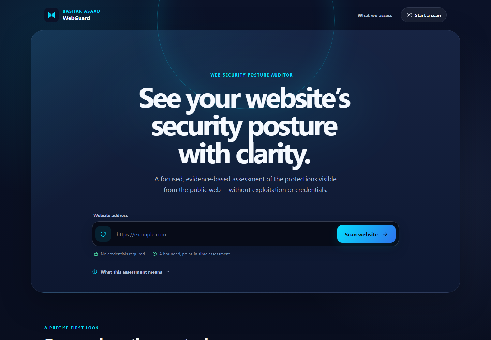

<p align="center">
  
</p>

# WebGuard

**WebGuard v0.1.0** is a passive, low-impact web security posture auditor published by
**Bashar Asaad (بشار أسعد)**. It evaluates a bounded set of externally visible controls and
returns evidence-based findings, transparent coverage-aware scoring, and operational limitations.

WebGuard is not a penetration-testing framework. It does not exploit targets, brute-force
credentials, enumerate services, fuzz inputs, scan ports, or prove that a website is secure.

> Use WebGuard only on systems you own or are authorized to assess.

## What is included

- a Python 3.12+ CLI;
- deterministic JSON and self-contained offline HTML reports;
- a stateless FastAPI API;
- a React web interface;
- hardened backend and frontend containers with a same-origin Nginx gateway; and
- an SSRF-resistant outbound networking boundary that validates and pins every destination and
  revalidates every redirect.

WebGuard v0.1.0 has no accounts, database, scan history, analytics, active exploitation, CVE
matching, or publicly hosted service.

## The 19 passive checks

| Area | Checks |
| --- | --- |
| Transport (6) | HTTPS availability, HTTP-to-HTTPS redirect, TLS trust, TLS hostname, certificate expiry, HTTPS downgrade |
| Headers (6) | HSTS, CSP, `nosniff`, Referrer-Policy, Permissions-Policy, clickjacking protection |
| Cookies (3) | Secure, HttpOnly, SameSite |
| Content (1) | bounded static mixed-content references |
| Hygiene (3) | `security.txt`, Server disclosure, X-Powered-By disclosure |

The exact semantics and limitations are documented in [docs/CHECKS.md](docs/CHECKS.md).

## Scoring, coverage, and failed assessments

The scoring ruleset is deterministic and versioned. A score is shown only when at least 70% of
applicable rule weight was evaluated and essential HTTPS/TLS evidence is available.
`NOT_APPLICABLE` rules neither earn nor lose points. Operational errors reduce coverage instead of
being mislabeled as vulnerabilities.

`COMPLETED`, `PARTIAL`, and `FAILED` describe how much reliable assessment evidence WebGuard could
obtain. A `FAILED` assessment can still contain established findings, but its score may be withheld.
It is not the same thing as a software crash, and it is not itself a vulnerability finding.

> A high WebGuard score reflects only the controls evaluated by this tool. It does not prove that a
> website is free of vulnerabilities or compliant with any standard.

See [docs/SCORING.md](docs/SCORING.md) for weights, coverage, score withholding, grades, and caps.

## Supported and tested environments

- CLI requirement: Python 3.12 or newer.
- Frontend development requirement: Node.js 22.13 or newer.
- Local web application: Docker Engine/Desktop with Docker Compose v2 and Linux containers.
- Verified for v0.1.0 preparation: Windows with Python 3.12 and Docker Desktop 4.91 / Engine 29.8 /
  Compose 5.5 on WSL2.
- The CLI and Compose files are designed to be portable to Linux and macOS, but clean-machine
  validation on those operating systems is still pending.

## Download the source

After the GitHub repository is published, either download and extract the **Source code** archive
from the release page, or copy the repository URL from GitHub and run:

```text
git clone <URL copied from GitHub>
cd WebGuard
```

No PyPI package or standalone executable is promised for v0.1.0. A release Wheel may be installed
directly from the GitHub Release assets when one is provided.

## CLI quick start

### Windows PowerShell

From the repository root:

```powershell
py -3.12 -m venv .venv
.\.venv\Scripts\python.exe -m pip install .
.\.venv\Scripts\webguard.exe version
.\.venv\Scripts\webguard.exe scan https://example.com
```

### Linux or macOS

From the repository root:

```bash
python3.12 -m venv .venv
.venv/bin/python -m pip install .
.venv/bin/webguard version
.venv/bin/webguard scan https://example.com
```

For a downloaded release Wheel, replace `.` in the install command with the Wheel filename, for
example `cybernet_webguard-0.1.0-py3-none-any.whl`. The distribution name is a retained technical
identifier; the official publisher is Bashar Asaad.

### JSON and HTML reports

Windows:

```powershell
.\.venv\Scripts\webguard.exe scan https://example.com --format json
.\.venv\Scripts\webguard.exe scan https://example.com --format json --output result.json
.\.venv\Scripts\webguard.exe scan https://example.com --report report.html
```

Linux/macOS:

```bash
.venv/bin/webguard scan https://example.com --format json
.venv/bin/webguard scan https://example.com --format json --output result.json
.venv/bin/webguard scan https://example.com --report report.html
```

Output files must end in `.json` or `.html`, their parent directory must already exist, and
WebGuard refuses to overwrite an existing report. JSON written to stdout contains JSON only.

Illustrative sanitized terminal summary—the actual score and findings depend on the target and
time of the scan:

```text
WebGuard by Bashar Asaad
Web Security Posture Auditor

Target   https://example.com/
Status   COMPLETED
Score    site-dependent
Coverage site-dependent
Findings ordered by severity with separate operational errors
```

See [docs/CLI.md](docs/CLI.md) and [docs/REPORTING.md](docs/REPORTING.md) for exit codes and report
contracts.

## Local web application with Docker

The local profile needs no public domain, paid service, TLS bypass, or manual security weakening.
It publishes only the Nginx frontend on `127.0.0.1:8080`; the API remains private inside Docker.

### Windows PowerShell

```powershell
docker compose --env-file .env.example `
  -f docker-compose.production.yml `
  -f docker-compose.local-validation.yml config

docker compose --env-file .env.example `
  -f docker-compose.production.yml `
  -f docker-compose.local-validation.yml build

docker compose --env-file .env.example `
  -f docker-compose.production.yml `
  -f docker-compose.local-validation.yml up -d --wait
```

### Linux or macOS

```bash
docker compose --env-file .env.example \
  -f docker-compose.production.yml \
  -f docker-compose.local-validation.yml config

docker compose --env-file .env.example \
  -f docker-compose.production.yml \
  -f docker-compose.local-validation.yml build

docker compose --env-file .env.example \
  -f docker-compose.production.yml \
  -f docker-compose.local-validation.yml up -d --wait
```

Open **http://webguard.localhost:8080**. The exact `webguard.localhost` hostname is required by the
local Host allowlist; `http://localhost:8080` is intentionally rejected.



### Status, restart, stop, and update

Use the same `--env-file` and two `-f` arguments shown above:

```text
docker compose ... ps
docker compose ... restart
docker compose ... up -d --wait
docker compose ... down
```

For a Git checkout, update with `git pull --ff-only`, then rerun `build --pull` and `up -d --wait`.
For a downloaded source archive, download the newer release into a new directory and run the same
build/start commands there. WebGuard v0.1.0 stores no application data, so there is no database
migration.

The local-validation override must never be used as proof of public-production readiness. Public
hosting requires TLS, DNS, firewall, egress, monitoring, rate-limit, smoke-test, and rollback
evidence described in [docs/DEPLOYMENT.md](docs/DEPLOYMENT.md).

## Troubleshooting

- **`python3.12` or `py -3.12` is missing:** install Python 3.12+ and ensure it is available in the
  current shell.
- **PowerShell blocks activation:** activation is optional; run the `.venv\Scripts\*.exe` commands
  directly as shown above.
- **`webguard.localhost` does not open:** confirm the containers are running with `docker compose
  ... ps`, use the exact hostname, and verify port 8080 is free.
- **Docker cannot connect to the engine:** start Docker Desktop/Engine and wait until Linux
  containers are ready.
- **A report already exists:** choose a new path; WebGuard never silently overwrites reports.
- **A scan is `FAILED` or has no score:** inspect coverage and operational errors. DNS, TLS, target
  policy, and transient network failures are kept distinct from security findings.
- **A private/local target is rejected:** this is expected SSRF protection and has no bypass switch.

## Development verification

Development dependencies are separate from end-user installation:

```powershell
py -3.12 -m venv .venv
.\.venv\Scripts\python.exe -m pip install -e ".[dev]"
.\.venv\Scripts\python.exe -m pytest
.\.venv\Scripts\ruff.exe check .
.\.venv\Scripts\mypy.exe
```

Frontend verification runs from `frontend/` with `npm ci`, `npm test`, `npm run typecheck`,
`npm run lint`, and `npm run build`. The repository's CI definition mirrors these commands, but it
is not considered GitHub-verified until it runs in the future public repository.

## Security and privacy

Targets and results are not persisted by default. Cookie values, authorization values, sensitive
query values, raw response bodies, pinned IPs, socket details, and exception traces are excluded
from public reports and normal logs. All outbound HTTP access passes through the protected client.

Read [SECURITY.md](SECURITY.md) before modifying network behavior. A private vulnerability-reporting
channel must be enabled on the future GitHub repository before publication. The intended channel
is GitHub Private Vulnerability Reporting; no disclosure email is designated. Do not disclose a
suspected vulnerability in a public issue.

## License, publisher, and branding

Copyright (c) 2026 Bashar Asaad.

The original source code is licensed under the [MIT License](LICENSE). Bashar Asaad's personal
name, logo, and visual identity are governed separately by [BRANDING.md](BRANDING.md). The retained
technical identifiers `cybernet-webguard` and `VITE_CYBERNET_CONTACT_URL` do not identify CyberNet
as the publisher of this release. Dependency licensing is summarized in
[THIRD_PARTY_NOTICES.md](THIRD_PARTY_NOTICES.md).

The project is currently a **v0.1.0 release candidate**. No GitHub Release, public deployment, or
independently established real-world adoption is claimed yet.
