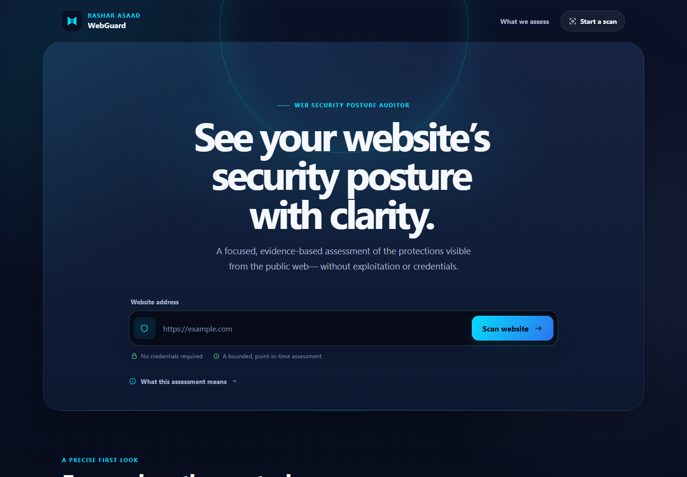

<p align="center">
  
</p>

# WebGuard

**WebGuard v0.1.0** is a passive, low-impact web security posture auditor published by
**Bashar Asaad (بشار أسعد)**. It evaluates a bounded set of externally visible controls and
returns evidence-based findings, coverage-aware scoring, and clear operational limitations.

WebGuard does not exploit targets, test credentials, enumerate services, fuzz inputs, scan ports,
or prove that a website is secure.

> Use WebGuard only on systems you own or are authorized to assess.

## What is included

- one Python 3.12+ package and `webguard` command;
- a complete local web interface bundled inside that package;
- human terminal output, deterministic JSON, and self-contained offline HTML reports;
- 19 passive checks across transport, headers, cookies, content, and disclosure hygiene; and
- an SSRF-resistant network boundary that validates and pins destinations and revalidates every
  redirect.

There are no accounts, database, persistent scan history, analytics, active exploitation, or
publicly hosted service.

## Install from GitHub

Download and extract the source archive, or clone the future official repository, then open a
terminal in the project directory.

### Windows PowerShell

```powershell
py -3.12 -m venv .venv
.\.venv\Scripts\python.exe -m pip install .
.\.venv\Scripts\webguard.exe web
```

### Linux or macOS

```bash
python3.12 -m venv .venv
.venv/bin/python -m pip install .
.venv/bin/webguard web
```

The command selects an available loopback port, prints the local URL, and opens the default
browser. Keep the terminal open while using the page; press `Ctrl+C` to stop it. End users do not
need Node.js or a second server because the built React interface is included in the Python
package.

A release Wheel can be installed by replacing `.` with its filename, for example
`cybernet_webguard-0.1.0-py3-none-any.whl`. No PyPI package or standalone executable is promised
for v0.1.0.

## Local web options

```text
webguard web
webguard web --port 8080
webguard web --no-open
webguard web --host 127.0.0.1
webguard web --host localhost --port 8080 --no-open
```

For safety, `--host` accepts loopback addresses only. The web page and its API share one local
origin; no API command, proxy, hostname setup, or environment file is required. See
[docs/WEB.md](docs/WEB.md) for behavior and troubleshooting.



## Terminal scans and reports

```text
webguard version
webguard scan https://example.com
webguard scan https://example.com --format json
webguard scan https://example.com --format json --output result.json
webguard scan https://example.com --report report.html
```

Output files must end in `.json` or `.html`, their parent directory must already exist, and
WebGuard refuses to overwrite an existing report. JSON written to standard output contains JSON
only. See [docs/CLI.md](docs/CLI.md) and [docs/REPORTING.md](docs/REPORTING.md).

## Checks and scoring

| Area | Checks |
| --- | --- |
| Transport (6) | HTTPS availability, HTTP-to-HTTPS redirect, TLS trust, TLS hostname, certificate expiry, HTTPS downgrade |
| Headers (6) | HSTS, CSP, `nosniff`, Referrer-Policy, Permissions-Policy, clickjacking protection |
| Cookies (3) | Secure, HttpOnly, SameSite |
| Content (1) | bounded static mixed-content references |
| Hygiene (3) | `security.txt`, Server disclosure, X-Powered-By disclosure |

The score is shown only when enough applicable evidence was evaluated and essential HTTPS/TLS
evidence is available. Operational errors reduce coverage instead of being mislabeled as
vulnerabilities. `COMPLETED`, `PARTIAL`, and `FAILED` describe assessment coverage, not whether a
site is vulnerable and not whether WebGuard crashed.

Read [docs/CHECKS.md](docs/CHECKS.md) and [docs/SCORING.md](docs/SCORING.md) for the exact semantics.

> A high WebGuard score reflects only the controls evaluated by this tool. It does not prove that a
> website is vulnerability-free or compliant with any standard.

## Troubleshooting

- **`webguard` is not found:** use the executable inside the virtual environment, or activate that
  environment first.
- **The browser did not open:** copy the URL printed by `webguard web` into a browser, or run with
  `--no-open` when automatic opening is unwanted.
- **A chosen port is busy:** omit `--port` so WebGuard selects an available port, or choose another
  port.
- **The page stops working after closing the terminal:** the local server runs in that terminal;
  start `webguard web` again.
- **A scan is `FAILED` or has no score:** inspect coverage and operational errors. DNS, TLS, target
  policy, and transient network failures remain separate from findings.
- **A private or local target is rejected:** this is expected SSRF protection and has no bypass.

## Development verification

```powershell
py -3.12 -m venv .venv
.\.venv\Scripts\python.exe -m pip install -e ".[dev]"
.\.venv\Scripts\python.exe -m pytest
.\.venv\Scripts\ruff.exe check .
.\.venv\Scripts\mypy.exe
```

Frontend development requires Node.js 22.13+ and uses `npm ci`, `npm test`, `npm run typecheck`,
`npm run lint`, and `npm run build` from `frontend/`. The production build is written directly into
the Python package. See [docs/FRONTEND.md](docs/FRONTEND.md).

## Security, license, and release status

Targets and results are not persisted by default. Sensitive response values, raw bodies, pinned
addresses, socket details, and exception traces are excluded from public reports and normal logs.
Read [SECURITY.md](SECURITY.md) before changing network behavior.

The original source code is licensed under the [MIT License](LICENSE). Bashar Asaad's personal
name, logo, and visual identity are governed separately by [BRANDING.md](BRANDING.md). Dependency
licensing is summarized in [THIRD_PARTY_NOTICES.md](THIRD_PARTY_NOTICES.md).

This is a **v0.1.0 release candidate**. No repository URL, GitHub Release, public deployment, or
real-world adoption is claimed yet. GitHub Private Vulnerability Reporting is the intended private
security channel once the official repository exists; no disclosure email is designated.
